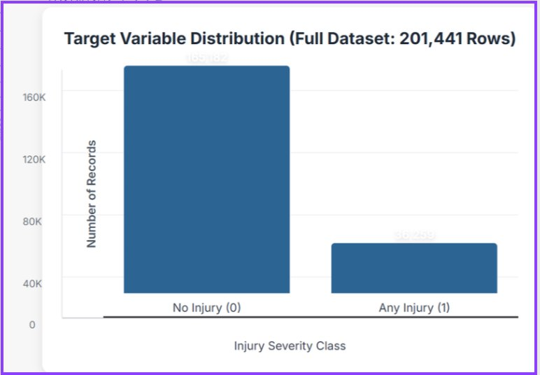
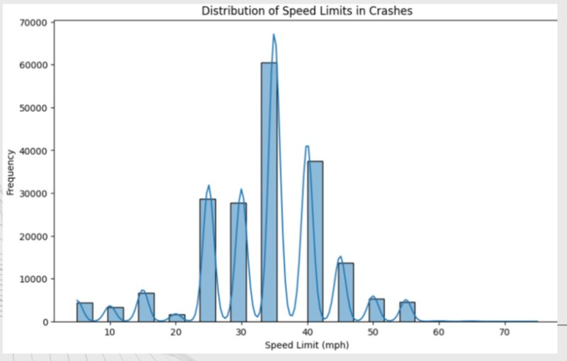
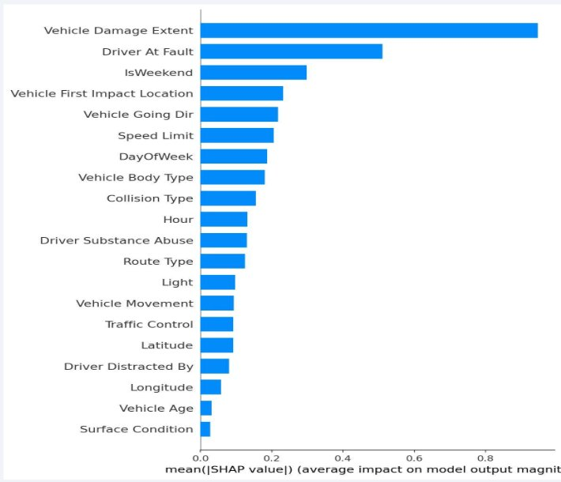
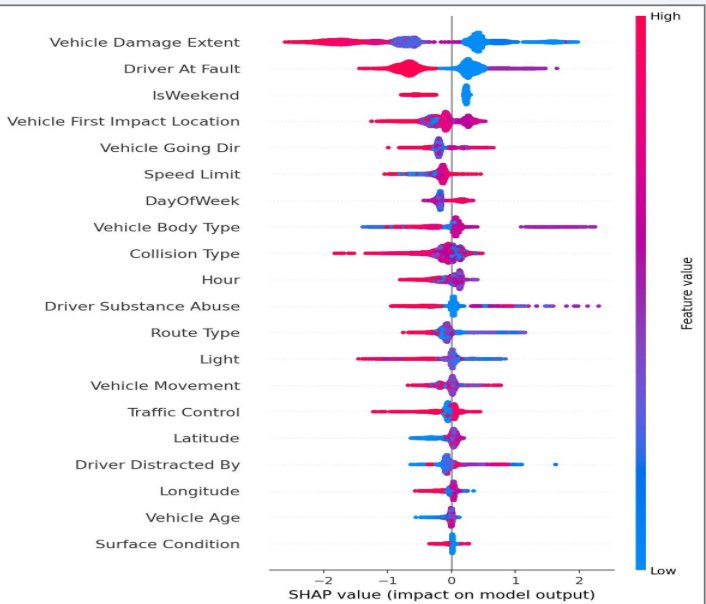
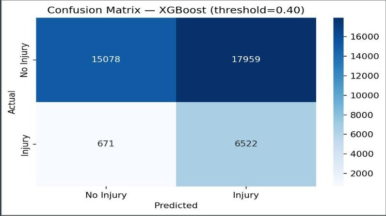
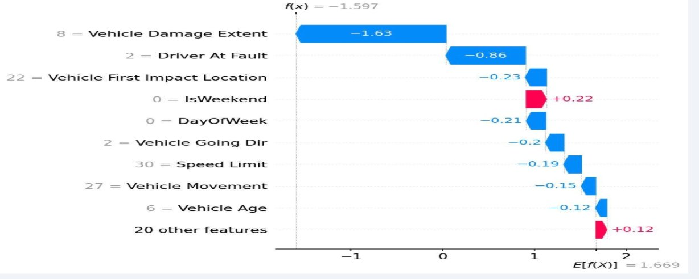

# DATA4382-Final
### Vision Zero Injury Risk Simulator | Montgomery County Road Safety Prediction

> **Data Science Capstone 2**  
> *Josh Bui · Danson Vo*

---

## Business Problem / Motivation

Montgomery County has a serious road safety problem. Looking at the data, over 200,000 crashes have been recorded across the county and about 18% of them resulted in some kind of injury. What made this interesting to us is that there are currently no proactive tools being used to predict or prevent these injuries before they happen. Everything is reactive.

The goal of this project was to change that. We wanted to build something that could actually help transportation planners identify high-risk crash scenarios before someone gets hurt, instead of just analyzing crashes after the fact.

- **201,147** crashes recorded across Montgomery County
- **35,965** resulted in injury (18% of all crashes)
- **0** proactive prediction tools currently in use by the county

---

## Project Overview

We built the Vision Zero Injury Risk Simulator, a machine learning model that predicts whether a crash scenario is likely to result in injury. Planners can input conditions like road type, time of day, speed limit, and weather to get an injury risk probability along with an explanation of what factors drove that prediction.

| | |
|--|--|
| **Final Model** | XGBoost (Threshold = 0.40) |
| **Injury Recall** | 91% (6,522 of 7,193 injuries caught) |
| **Training Data** | 201,147 real Montgomery County crash records |
| **Features Used** | 29 (including 3 engineered interaction terms) |
| **Resampling** | SMOTETomek |
| **Explainability** | SHAP global and local explanations |
| **Fairness Tested** | 5 subgroups, no group below 0.70 recall |

The model correctly flags 9 out of 10 injury-risk crash scenarios on a held-out test set of 40,230 records.

---

## Data

| | |
|--|--|
| **Source** | [Montgomery County Crash Reporting - Drivers Data](https://data.montgomerycountymd.gov/Public-Safety/Crash-Reporting-Drivers-Data/mmzv-x632) |
| **Type** | Structured tabular CSV |
| **Size** | 201,147 records, 39 original features |
| **Target Variable** | Binary: Injury (1) vs. No Injury (0) |
| **Class Split** | 82% No Injury / 18% Injury |
| **Date Range** | 2018 to 2024 |

Some of the most important features in the dataset include weather conditions, surface condition, light condition, speed limit, whether the driver was at fault, vehicle damage extent, substance abuse involvement, collision type, and lat/long coordinates of the crash.

---

## Data Preprocessing

### Cleaning Steps
- Standardized the `Injury Severity` column (uppercased and stripped whitespace)
- Mapped the original 5 severity classes down to a binary target: `NO APPARENT INJURY` becomes 0, everything else becomes 1
- Dropped any rows missing a target value

### Handling Missing Values
- Categorical columns were filled with `"UNKNOWN"` so that missingness itself could be a signal to the model
- Numeric columns were filled using median values calculated from the training set only so we did not leak any test data
- Vehicle Year values of 0 were replaced with NaN before computing Vehicle Age

### Feature Engineering
We created three interaction terms based on what we knew about high-risk crash conditions:

| Feature | How It's Calculated | Why |
|---------|-------------------|-----|
| `Speed_x_Night` | Speed Limit x IsNight | High speed at night is especially dangerous |
| `Substance_x_Night` | Substance Abuse x IsNight | Impaired driving at night is a major risk factor |
| `VehicleAge_x_Collision` | Vehicle Age x Collision Type | Older vehicles in certain crash types lack modern safety features |

We also engineered `Hour`, `DayOfWeek`, `IsNight`, `IsWeekend`, and `Vehicle Age` from the raw datetime and vehicle year columns.

---

## Exploratory Data Analysis

### Class Imbalance
The dataset is pretty heavily imbalanced at 82% no-injury vs 18% injury. This is actually really common in crash datasets and it means that standard accuracy is kind of a useless metric here. A model that just predicts "no injury" every single time would be 82% accurate but completely worthless. This pushed us toward using recall on the injury class as our main metric and using SMOTETomek to handle the imbalance during training.



### Speed Limit Distribution
Most crashes in Montgomery County happen on roads with 30-35 mph speed limits, which makes sense since those are the most common road types in the county. However, crashes on higher speed limit roads (45-55 mph) tend to have a higher injury rate even if there are fewer of them overall.



### Top Predictors from SHAP
After training the final model we ran SHAP on all 40,230 test cases to see what actually drives predictions globally. Vehicle Damage Extent dominates all other features by a wide margin.



### SHAP Beeswarm Plot
The beeswarm plot shows not just which features matter but also the direction of their impact. Red dots mean high feature values, blue means low. For Vehicle Damage Extent you can see that high values (severe damage) push the prediction strongly toward injury.



---

## Modeling Approach

### Baseline Model
We started with Logistic Regression as our baseline. It got 80% accuracy but only 30% injury recall, which confirmed that a simple linear model was not going to cut it for this kind of imbalanced, non-linear problem.

### Why XGBoost?
We tested Logistic Regression, Random Forest, LightGBM, a Stacking Ensemble, and XGBoost. XGBoost with threshold tuning ended up being the best by a lot in terms of injury recall. It also works well with SHAP for explainability, which was important to us since we wanted planners to actually understand and trust the predictions.

---

## Model Training

### Tools Used
`XGBoost`, `imbalanced-learn`, `scikit-learn`, `SHAP`, `Pandas`, `NumPy`, `Gradio`

### XGBoost Hyperparameters
```python
XGBClassifier(
    n_estimators=300,
    max_depth=6,
    learning_rate=0.05,
    scale_pos_weight=5,
    eval_metric='logloss',
    random_state=42
)
```

### Training Process
1. Stratified 80/20 train/test split to preserve the 82/18 class ratio
2. Feature engineering applied to both splits
3. SMOTETomek resampling applied to the training set only (never touched the test set)
4. Label encoding fit on training data only, then applied to test
5. Threshold tuned to 0.40 on the held-out test set

### Data Leakage Prevention
This was something we were really careful about. Every preprocessing step including label encoding, null imputation, and SMOTETomek was fit only on training data. The test set was never used to inform any part of the pipeline until final evaluation.

---

## Results

### Confusion Matrix



| Metric | Value | Interpretation |
|--------|-------|----------------|
| **Injury Recall** | **91%** | Catches 9 in 10 real injury crashes |
| Overall Accuracy | 53% | Intentional tradeoff for safety |
| Precision | 26% | Acceptable false alarm rate |
| False Negatives | 671 | Missed injury crashes |
| False Positives | 17,959 | Non-injury crashes flagged |

### Model Comparison

| Model | Accuracy | Injury Recall | Notes |
|-------|----------|--------------|-------|
| Logistic Regression (Baseline) | 80% | 30% | Too simple for this problem |
| Random Forest | 76% | 44% | Decent but weak on the minority class |
| LightGBM | 81% | 27% | Best accuracy but sacrifices recall too much |
| Stacking Ensemble (XGB + LGBM + RF) | 80% | 29% | Did not improve over XGBoost alone |
| **XGBoost @ threshold=0.40** | **53%** | **91%** | **Final model** |

### Threshold Tuning
One of the more interesting parts of this project was the threshold analysis. The default classification threshold is 0.50 but we found that lowering it to 0.40 pushed our injury recall from 86% up to 91%.

| Threshold | Accuracy | Recall | Precision |
|-----------|----------|--------|-----------|
| 0.30 | 46.9% | 94.6% | 24.5% |
| 0.35 | 50.0% | 92.9% | 25.4% |
| **0.40 (selected)** | **53.0%** | **91.0%** | **26.4%** |
| 0.45 | 55.7% | 88.8% | 27.3% |
| 0.50 | 58.4% | 86.2% | 28.3% |
| 0.60 | 64.6% | 77.8% | 30.7% |

---

## Model Interpretation

### Global Explainability
We used SHAP to understand which features drive predictions across the full test set. Vehicle Damage Extent dominates all other predictors by a wide margin, followed by Driver At Fault and IsWeekend.


### Local Explainability (False Negative Case Study)
We also used SHAP waterfall plots to dig into specific cases where the model missed an injury. In this example the root cause was that Vehicle Damage Extent was recorded as low severity at the scene even though an injury occurred. This points to a real-world data quality problem where field reporters may underreport damage severity.



### Important Limitation
Vehicle Damage Extent is recorded after a crash, which means it technically is not available for true real-time prediction. It is the strongest predictor in the model but also a limitation we would need to address in a live deployment with a proxy variable.

---

## Key Insights

The biggest takeaway from this project is that injury prediction is actually very possible with the right model and the right metric. We went from a 30% injury recall baseline to 91% by switching to XGBoost, adding feature engineering, using SMOTETomek resampling, and tuning the decision threshold. Each of those steps contributed meaningfully to the final result.

From a practical standpoint, a model like this could genuinely shift Montgomery County from reactive to proactive road safety management. Instead of analyzing crashes after they happen, planners could use the simulator to identify which road conditions and scenarios are most dangerous and allocate resources accordingly.

---

## Conclusion

The Vision Zero Injury Risk Simulator achieves 91% injury recall on 40,230 held-out test cases. The model is explainable through SHAP, fairness-validated across 5 subgroups, and fully reproducible from the notebook and raw data. The 53% overall accuracy is an intentional design decision made because catching injuries matters more than minimizing false alarms in a road safety context.

---

## Future Work

- Find a pre-crash proxy for Vehicle Damage Extent so the model can be used for true real-time prediction
- Try target encoding instead of label encoding for high-cardinality features to preserve ordinality
- Test whether the model generalizes to other counties or Maryland statewide
- Set up an annual retraining schedule to prevent model drift as road conditions and vehicle technology change
- Incorporate additional data like seatbelt usage rates, exact impact speed, and vehicle safety ratings to improve both recall and precision at the same time

---

## How to Run

### 1. Install Dependencies
```bash
pip install -r requirements.txt
```

### 2. Get the Data
Download the dataset from the [Montgomery County Open Data portal](https://data.montgomerycountymd.gov/Public-Safety/Crash-Reporting-Drivers-Data/mmzv-x632) and save it as:
```
data/Crash_Reporting_-_Drivers_Data.csv
```

### 3. Run the Notebook (Google Colab recommended)
Open `notebooks/My_Deployment.ipynb` in Google Colab:

1. **Cell 1** - Installs all libraries (about 1 minute)
2. **Cell 2** - Upload your CSV, trains the model end to end (about 5 minutes)
3. **Cell 3** - Launches the interactive Vision Zero Simulator with a public Gradio link

### 4. Expected Output After Cell 2
```
Recall:    91.0%
Precision: 26.4%
Accuracy:  53.0%
```

The trained model saves to `model.pkl` and `pipeline_vars.pkl` automatically.

---

## Repository Structure

```
DATA4382-Final/
│
├── README.md                    <- This file
├── requirements.txt             <- Python dependencies
├── .gitignore                   <- Excludes data, model artifacts, checkpoints
│
├── notebooks/
│   └── My_Deployment.ipynb      <- Full pipeline: preprocessing, training, Gradio app
│
├── data/
│   └── README.md                <- Data source link and download instructions
│
├── models/
│   └── README.md                <- Notes on model artifacts (generated at runtime)
│
├── results/
│   └── README.md                <- Metrics, confusion matrix, model comparison tables
│
└── images/
    ├── confusion_matrix_real.png
    ├── shap_bar.png
    ├── shap_beeswarm.png
    ├── shap_waterfall_false_negative.png
    ├── class_distribution.png
    └── speed_limit_distribution.png
```

---

## Requirements

```bash
pip install -r requirements.txt
```

---

*DATA4382 Capstone 2 · Montgomery County Road Safety · Josh Bui & Danson Vo*
